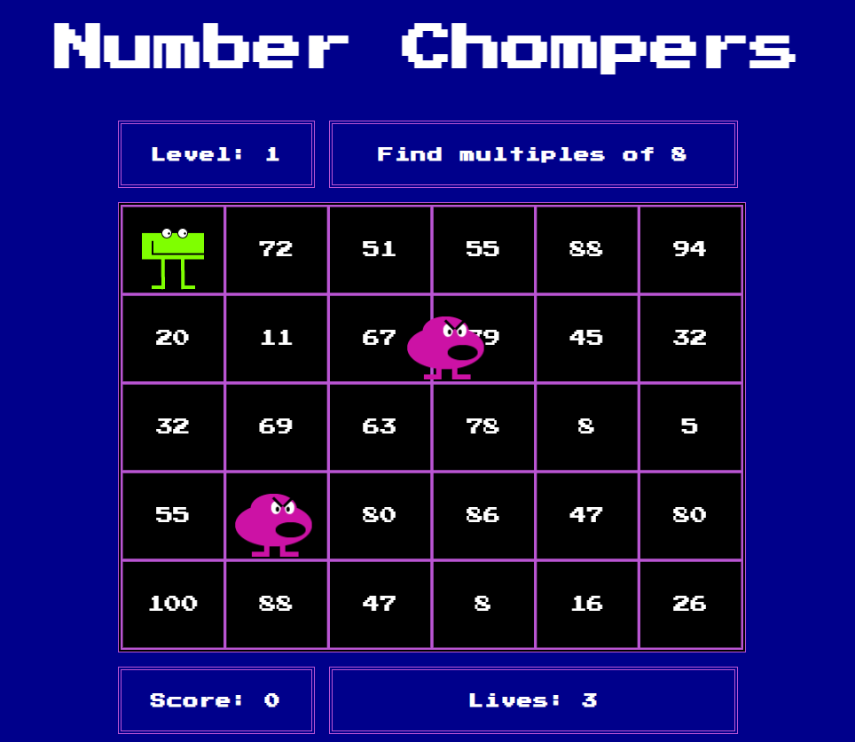
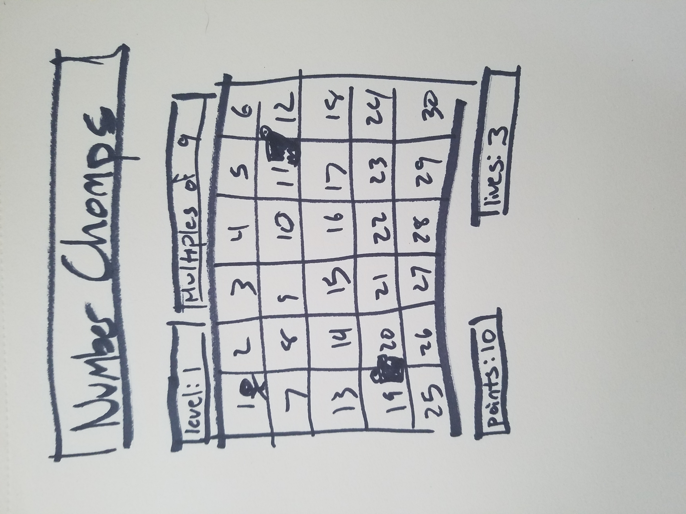

# Number Chompers
A Number Munchers Clone

## Deployed Site (https://number-chompers.netlify.app/)

## Concept
- Created for the Mintbean Aug 2021 Hackathon

### Inspiration
- The classic children's game [Number Munchers](https://en.wikipedia.org/wiki/Number_Munchers)!

### Installation Instructions
- None! Just a browser that can run HTML5 Canvas and Javascript

## Technologies Used
- HTML5 Canvas
- Javascript
- HTML/CSS

### Credits
- This fantastic game development tutorial by [Chris Perko](https://youtu.be/3EMxBkqC4z0) that refreshed my memory and got me started
- SFX by [Beep Yeah!](https://beepyeah.itch.io/8-bit-sfx-pack)
- Sprite drawings by me
- Social Icons by [Font Awesome](https://fontawesome.com)

## Approach

### Overview
Move your Chomper using the WASD keys and press the spacebar to chomp a number! If you need to pause, press Escape. Chomp all the correct answers to advance to the next level, but watch out for the baddies that want to stop you! Bumping into a baddie or chomping an incorrect answer will make you lose a life! But don't worry, you'll earn an extra life for every 100 points.

### Wireframe

### Development Plan
- Early stage game with rectangles & no styling
- Styled game with sprites and SFX (**Current State**)
- 360-degree sprites, music, updated level, win, game over screens
- Additional types of levels

### MVP
- The user can move the Chomper around
- There are enemies in the level that move around independently 
- The enemies will make the Chomper lose a life if they touch
- The gameplay provides the player with a factor to find its multiples
- The user can chomp numbers and be told they are right or wrong
- The user can earn points and extra lives if they are right
- The user loses lives if they are wrong
- The user can pause the game
- The user can advance to the next level
- The user can win
- The user can lose
- The game is styled beyond placeholders

## Stretch Goals
- [] 360-degree sprites
- [] Background music
- [] Other level types (fractions, prime numbers, factors of a number, min/max for factor levels)
- [] Animations between levels

## Challenges
### Solved Issues
- **Impossible levels**: Since the numbers are randomly generated, there were occasional times that the level would load and be impossible to win. I solved this issue with a check before the built level is passed to the game. I also added a counter of how many squares of the 30 are correct answers and set it so that each level has to have at least 10 correct answers before it is passed to the game.
- **Level up chomping**: Initially when a subsequent level loaded, the player would still be in chomp=true and chomp the number of the square they were sitting on. This resulted in accidentally losing lives and other playability issues. I solved this by adding a transition screen between levels that requires the player to press Enter before starting the next level.
- **Levels advancing before the win screen**: This was causing a game-breaking error because the game would try to advance the array past its length. I tried out multiple catches on the Game and Level classes before realizing the issue was actually on the Square class.

### Unsolved Issues
- **Better way to load level info**: Loading it all into the Game class is not sustainable, but since the Enemy class uses the game information I'm having trouble finding a better way to load it without completely refactoring
- **Faster way to check for enough answers on board**: There are times when the level check has to run many times over and the load time slows down as a result
- **Better scoring that doesn't clear but still allows for extra lives** (and doesn't run forever): I don't like resetting the score to 0 for every extra life, but when I set it to a modulo operation for divisibility by 100 it runs continuously (due to the updating) until the player chomps another correct answer. 
- Leave the outlines when squares are chomped (undecided - just an aesthetic thing)
- **get game over sfx to only play once instead of on loop**: It only happens with the game over screen. All the other screens only play once. Very annoying.

## Acknowledgements
- To Mintbean for organizing this great opportunity
- Andy for beta testing, keeping me fed, and cheering me on

## Deployed Site (https://number-chompers.netlify.app/)

## Versioning & Releases
9/2/2021 - initial release

## Author
[Elizabeth Guerra](https://elizabeth-guerra.com)